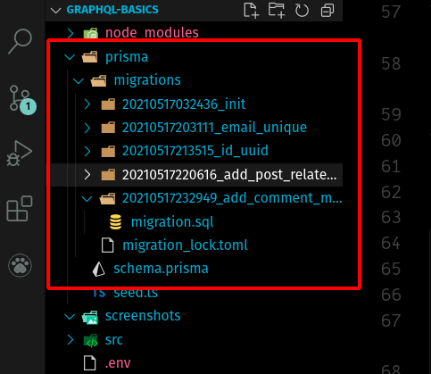

## Description

This repo is my version/follow-up for the udemy course [The Modern GraphQL Bootcamp (with Node.js and Apollo)](https://www.udemy.com/course/graphql-bootcamp/)  
*clarification: uses Apollo Client(React); on Backend uses [GraphQL-Yoga](https://github.com/dotansimha/graphql-yoga) and as ORM [Prisma V2](https://www.prisma.io/docs/)
I made some variations that are my own choices. And my main interest was in the backend part.

## Differences

Here is the list of my preferences and deviations from the original course

- Typescript instead of Javascript
- Use Prisma V2 insted of V1
- Postgres db instance from AWS instead of Heroku(they use AWS under the hood)

## Challenges encountered

Prisma V2 is a beast! Since the course does not cover Prisma v2 I had to learn it from scratch, but it is definitely worth it. 
It's an amazing tool.

Consists mainly of three components

### Prisma Schema

Here we define **datasource** the database flavor  
and also the **models** those are the database entities tables and relations

```graphql
datasource db {
  provider = "postgresql"
  url      = env("DATABASE_URL")
}

generator client {
  provider = "prisma-client-js"
}

model User {
  id       String    @id @default(uuid())
  name     String    @db.VarChar(255)
  email    String    @unique
  posts    Post[]
  comments Comment[]
}

model Post {
  id        String    @id @default(uuid())
  title     String    @db.VarChar(255)
  body      String
  published Boolean
  User      User      @relation(fields: [userId], references: [id])
  userId    String
  comments  Comment[]
}
```

### Prisma Client

The self generated and type-safe query builder is based on **prisma schema**
It's API is huge and it will take some time to sink in. But thanks to type-safe  
and auto-completion you can start fairly quickly
That **query builder** is mainly used in solvers

```typescript
const Mutation = {
  Mutation: {
    createUser: async (
      _: undefined,
      { input }: { input: { name: string; email: string; age?: number } },
      { prisma }: { prisma: PrismaFull },
    ): Promise<User> => {
      const isEmailTaken = await prisma.user.findUnique({
        where: {
          email: input.email,
        },
      });
      // check if email is already taoken; actually prisma when create user enforce email
      // uniqueness so probably is better option wrap user create in a try catch an send an
      // error message in case this fail because of email
      if (isEmailTaken) {
        throw new Error(`The email ${input.email} is already taken. Have you forget your password`);
      }
      const newUser = await prisma.user.create({
        data: {
          ...input,
        },
      });
      return newUser;
    },
  },
};
```

### Prisma Migrate

Is an imperative database schema migration tool, enable you to:

- Keep yout db schema in sync with **Prisma Schema**
- Maintain existing data in your database

Generates a history of `.sql` migation files in the `prisma` folder at the root of the project.



## Notes

Comments on topics that may be useful to others

1. Prisma Schema does not yet have [Cascading deletes](https://www.prisma.io/docs/guides/database/advanced-database-tasks/cascading-deletes). There's this open(may,2021) [issue](https://github.com/prisma/prisma/issues/2810)

So for example, delete a user that have many posts and each post may have many comments was done like this:

```typescript
    deleteUser: async (
      _: undefined,
      { userId }: { userId: string },
      { prisma }: { prisma: PrismaFull },
    ): Promise<User> => {
      try {
        const userPosts = await prisma.user.findUnique({ where: { id: userId } }).posts();
        const userPostsIds = userPosts.map((post) => post.id);
        const commentsFromPosts = userPostsIds.map((postId) =>
          prisma.comment.deleteMany({ where: { postId } }),
        );
        // remove comments from user posts
        const deleteCommentsFromPosts = await Promise.all(commentsFromPosts);
        // remove user own comments
        const deleteUserComments = await prisma.comment.deleteMany({ where: { userId } });
        // remove all post from user
        const deleteAllUserPosts = await prisma.post.deleteMany({ where: { userId } });
        // finaly remove user
        const deleteUser = await prisma.user.delete({
          where: {
            id: userId,
          },
        });
        return deleteUser;
      } catch (error) {
        throw new Error(`Couldn't delete user with Id:${userId}; ${error?.message ?? ''}`);
      }
    },
```
